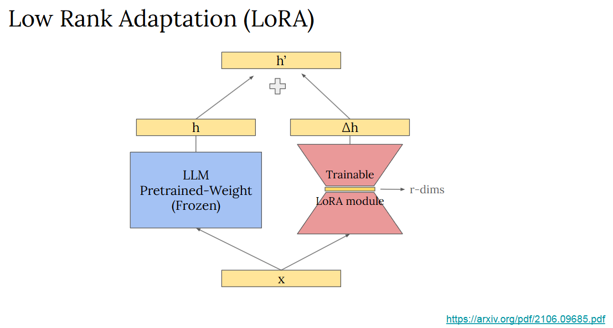

# 文言文翻譯大型語言模型 | NTU 應用深度學習

這是一個針對**大型語言模型 (LLM) 的指令微調 (Instruction Tuning)** 的專案，主要目標是訓練一個能夠理解並雙向翻譯**文言文與白話文**的模型。

專案基於台灣本土的開源大型語言模型 `Taiwan-LLaMa-7B-v2.0-chat`，並採用了高效的 **QLoRA** 微調技術，在有限的硬體資源下，成功地讓模型學會了特定領域的翻譯能力。

## 專案亮點

*   **前沿的大型語言模型技術**：基於強大的 LLaMa 架構，對 7B 參數級的 `Taiwan-LLM` 進行指令微調，展現了跟進最新 LLM 發展趨勢的能力。
*   **高效的參數微調 (PEFT)**：採用 **QLoRA (Quantized Low-Rank Adaptation)** 技術，大幅降低了模型微調所需的記憶體與計算資源，使其能在消費級硬體（RTX3070）上完成訓練。
*   **可量化的優異表現**：在驗證集上達成了 **平均困惑度 (Mean Perplexity) `3.78`** 的優異成績，證明模型在微調後對文言文有著高度的理解與生成能力。
*   **指令遵循能力**：成功地將通用對話模型，特化為能夠遵循特定指令（例如：「將下面的句子翻譯成文言文」）的專業領域模型。


## 技術棧 (Tech Stack)

*   **程式語言**: Python
*   **主要函式庫**: PyTorch, Transformers, PEFT, bitsandbytes, Accelerate
*   **核心模型**: `yenting-yeh/Taiwan-LLM-7B-v2.0-chat`
*   **微調技術**: **QLoRA**




## 快速開始

### 1. 環境設置

安裝專案所需的 Python 套件。
```bash
pip install -r requirements.txt
```
> **注意**：由於 `bitsandbytes` 函式庫的相容性問題，強烈建議在 Linux 或 WSL 環境下執行此專案。Windows 使用者請參考文末的**附錄：Windows 環境建置指南**。

### 2. 下載模型與資料

下載 `Taiwan-LLM` 原始模型權重、我已訓練好的 QLoRA 適配器 (Adapter) 以及所需的資料集。

```bash
bash ./download.sh
```

### 3. 重現預測結果

執行以下指令，即可載入預訓練模型與 QLoRA 適配器，快速生成翻譯結果。

```bash
# bash ./run.sh <path_to_Taiwan-LLM-folder> <path_to_adapter_checkpoint> <path_to_input.json> <path_to_output.json>
bash ./run.sh ./Taiwan-LLM-7B-v2.0-chat ./adapter_checkpoint ./data/public_test.json ./submission.json
```

## 自行微調模型 (Fine-tuning)

專案中包含了完整的訓練與測試腳本，如果您想從頭開始訓練模型，請遵循以下步驟：

### Part 1: 模型微調

使用 `finetune.py` 腳本，對 `Taiwan-LLM` 進行 QLoRA 微調。

```bash
python ./finetune.py \
--model_path ./Taiwan-LLM-7B-v2.0-chat \
--train_data ./data/train.json \
--eval_data ./data/public_test.json \
--epoch 1 \
--seq_length 1024 \
--log_freq 0.1 \
--output_dir ./paged
```
> 微調完成後，訓練好的 QLoRA 適配器權重將會儲存在 `--output_dir` 指定的目錄中。

### Part 2: 模型推論

使用 `inference.py` 腳本，載入原始的 `Taiwan-LLM` 模型以及您剛剛訓練好的 QLoRA 適配器，對測試資料進行推論。

```bash
python ./inference.py \
--model_path ./Taiwan-LLM-7B-v2.0-chat \
--peft_path ./paged \
--data ./data/private_test.json \
--output_path ./paged/prediction.json
```
> 推論結果將以 JSON 格式儲存在 `--output_path` 指定的路徑。

## 專案報告

更詳細的專案介紹、實驗設計與結果分析，包含 **LLM 微調策略**與**推論生成策略**的探討，請參考 [**專案完整報告 (Final Report)**](./report.pdf)。

---

## 附錄：Windows 環境建置指南

由於 `bitsandbytes` 函式庫在 Windows 平台上的相容性問題，建議在 **WSL (Windows Subsystem for Linux)** 環境下執行此專案。

### 安裝 WSL

可參考以下兩個教學安裝WSL，並自由選擇是否升級成WSL2。

[【WSL】Windows Subsystem for Linux 安裝及基本配置！](https://learn.microsoft.com/zh-tw/archive/blogs/microsoft_student_partners_in_taiwan/wsltune)

[舊版 WSL 的手動安裝步驟](https://learn.microsoft.com/zh-tw/windows/wsl/install-manual#step-4---download-the-linux-kernel-update-package)

安裝完畢後，可在開始頁面點擊Ubuntu開啟終端機。

### 安裝 Miniconda

參考 [MiniConda官網](https://docs.conda.io/projects/miniconda/en/latest/index.html) 進行安裝。

按照Linux欄位安裝完成後，請注意需在 `~/.bashrc` 文件中加入以下路徑：
```bash
export PATH="$PATH:/home/<your name>/miniconda3/bin"
```
儲存後記得執行 `source ~/.bashrc` 以讓變更生效。完成後，您的命令提示符前面應該會出現 `(base)` 字樣。

### 啟動虛擬環境

```bash
# 建立一個名為 ADL_HW3 的 Python 3.10 環境
conda create -n ADL_HW3 python=3.10

# 查看環境列表
conda env list

# 進入環境
conda activate ADL_HW3

# 退出環境
# conda deactivate
```
進入虛擬環境後，您就可以回到上方的「**快速開始**」章節，從 `pip install -r requirements.txt` 開始執行。